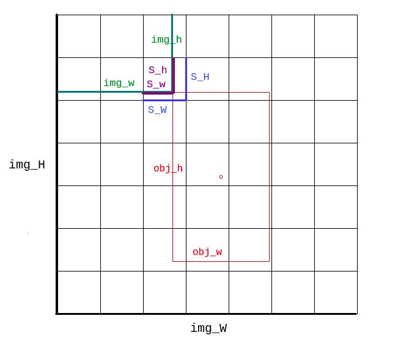
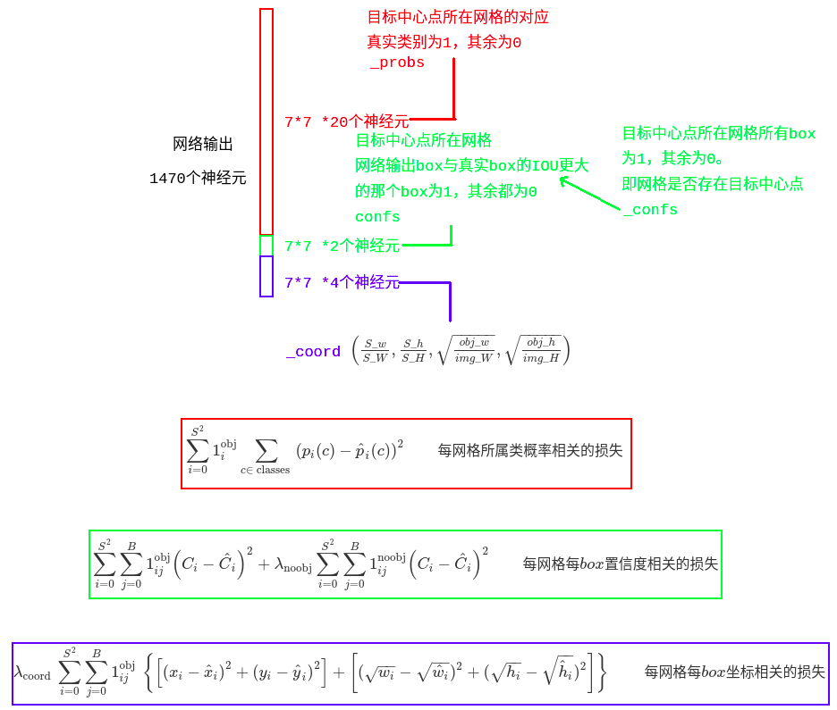

# yolo1
- 主要是网络输出与真值拟合，其中真值、预测值和损失函数是关键。
  - 真值在[data](darkflow/net/yolo/data.py)._batch()中
  - 损失函数在[train](darkflow/net/yolo/train.py).loss()中
  - 预测在[cy_yolo_findboxes](darkflow/cython_utils/cy_yolo_findboxes.pyx).yolo_box_constructor()里
- yolo v1[解读视频](vedio/YOLO/yolo.mp4)
- $\begin{aligned}
    Loss=& \sum_{i=0}^{S^{2}} \mathbb{1}_{i}^{\mathrm{obj}} \sum_{c \in \text { classes }}\left(p_{i}(c)-\hat{p}_{i}(c)\right)^{2} \qquad 每网格所属类概率相关的损失\\
    +& \sum_{i=0}^{S^{2}} \sum_{j=0}^{B} \mathbb{1}_{i j}^{\mathrm{obj}}\left(C_{i}-\hat{C}_{i}\right)^{2} +\lambda_{\mathrm{noobj}} \sum_{i=0}^{S^{2}} \sum_{j=0}^{B} \mathbb{1}_{i j}^{\mathrm{noobj}}\left(C_{i}-\hat{C}_{i}\right)^{2} \qquad 每网格每box置信度相关的损失\\
    +& \lambda_{\text {coord }} \sum_{i=0}^{S^{2}} \sum_{j=0}^{B} \mathbb{1}_{i j}^{\text {obj }}\left\{\left[\left(x_{i}-\hat{x}_{i}\right)^{2}+\left(y_{i}-\hat{y}_{i}\right)^{2}\right]+\left[(\sqrt{w_{i}}-\sqrt{\hat{w}_{i}})^{2}+(\sqrt{h_{i}}-\sqrt{\hat{h}_{i}})^{2}\right]\right\} \qquad 每网格每box坐标相关的损失
\end{aligned}$

- 划分网格

  

- loss

  

- Test输出阶段
  - x:$\frac{img\_w}{img\_W}$
  - y:$\frac{img\_h}{img\_H}$
  - w:$\frac{obj\_w}{img\_W}$
  - h:$\frac{obj\_h}{img\_H}$
  - p:网络预测的prob(拟合_prob的输出) * 网络预测的IOU(拟合confs的输出)
  - c:??? [nms](../darkflow/cython_utils/nms.pyx)里final_bbox[index, 4]没有4啊，这是啥??  可能是yolo2里的

- 后处理:画框
  - 将网络输出的x,y,w,h转换到图片box
  - Test输出p的最大值作为confidence，和对应的类别